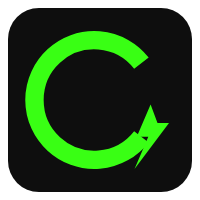
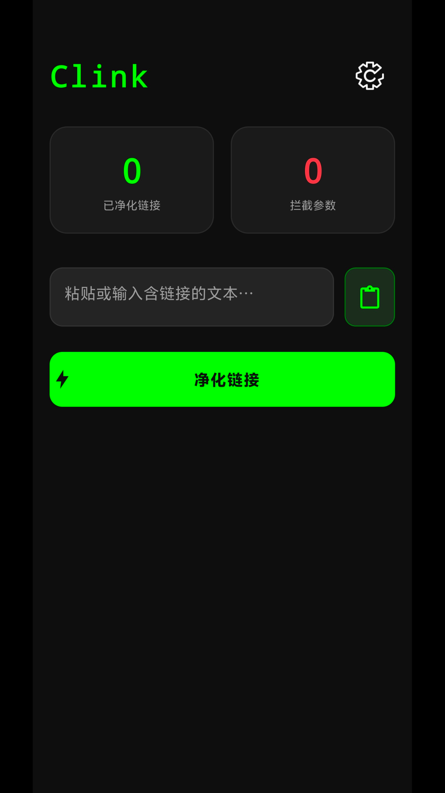
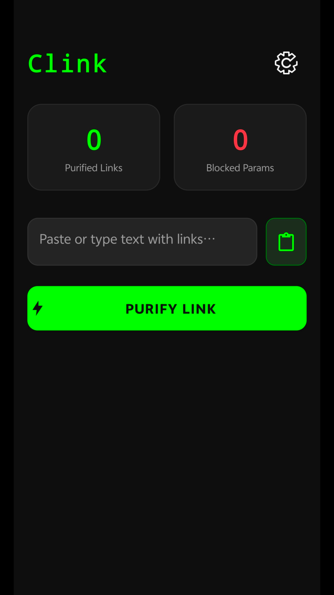

<div align="center">



# Clink - 链接隐私保护器

**一款专注于隐私保护的超级轻量级 Android 链接净化工具**

> **“链接本应纯净，追踪不该随行。”**

[](LICENSE)
[](https://android.com)
[](https://kotlinlang.org)

[English](#english) | [简体中文](#chinese)

</div>

---

<a name="chinese"></a>

## 📱 关于 Clink

做这个应用就是单纯厌烦了分享视频/帖子的链接都要带一大串跟踪id,根本没把用户隐私放眼里啊，光这个应用初版出来，我就写了快100条清理规则，应用厂商真踏马不是人啊。。。

应用安装包我也压到了1MB以内 600多KB 安装完1-2MB 看不惯动不动就把应用安装包都做200-300mb的人。。。

纯Kotlin编写 0%第三方UI库 都是原生API 拒绝臃肿 就一个安装包 不分架构啥的(因为没.so)

如果大家还看到有没净化掉的参数 欢迎提交PR贡献！（见[贡献指南](app/src/main/assets/readme.md)）

应用的读音差不多是Cleank（抱歉不会音标qwq）Clean link 的意思 也有Cut link 的意思

<div align="center">
  
</div>

接下来是功能介绍：

**Clink** 能够自动识别并移除 URL 中的 **93+ 种** 常见追踪参数（如 UTM 参数、广告追踪 ID、分享标识等），能帮助你：
- 🛡️ **保护隐私** - 移除设备指纹、用户ID等敏感追踪参数
- ✨ **净化链接** - 去除冗余参数，获得简洁干净的纯净链接
- 📊 **透明可见** - 详细展示每个被移除的参数及其用途
- 🚀 **快速便捷** - 一键净化，无多余操作

## ✨ 核心功能

### 🎯 智能净化引擎
- **93+ 追踪参数规则** - 覆盖淘宝、京东、拼多多、B站、抖音、小红书、微博、知乎、贴吧等主流平台
- **黑白名单机制** - 智能过滤追踪参数，保留功能性参数（如视频分P、时间戳等）
- **用户自定义规则** - 支持添加自定义黑/白名单规则
- **隐私等级标识** - 区分普通追踪参数和高危隐私参数（设备指纹、用户ID等）

### 🔧 多种使用方式
1. **快捷磁贴（推荐）** - 下拉通知栏，点击磁贴一键净化剪贴板链接
2. **系统分享** - 从任何应用分享链接到 Clink 进行净化
3. **应用内净化** - 手动粘贴链接进行净化

### 📊 Clink Lens 报告
- 清晰展示原始链接和净化后的链接对比
- 列出所有被移除的参数，包括参数名、值、说明和危险等级
- 本地统计累计净化次数和拦截参数总数

### 🎨 设计亮点
- **简洁原生 UI** - 基于 AppCompat 的轻量级界面设计
- **深色模式支持** - 完美适配系统主题切换
- **极致轻量** - APK 体积 < 1MB，零广告、零后台
- **多语言支持** - 中文/英文国际化（？

## 🎬 使用方法

### 方法一：快捷磁贴（最便捷）

1. 复制包含链接的文本
2. 下拉通知栏，点击 **Clink** 磁贴
3. 净化完成，纯净链接已保存到剪贴板 ✅

<details>
<summary>💡 如何添加磁贴到快捷设置？</summary>

1. 下拉通知栏至完全展开
2. 点击 **编辑** 按钮
3. 找到 **Clink** 磁贴并拖动到快捷设置区域
4. 点击 **完成** 保存

</details>

### 方法二：系统分享

1. 在任何应用中分享链接（如浏览器、社交应用）
2. 选择 **Clink** 作为分享目标
3. 自动净化！弹出 Clink Lens 报告，了解拦截详情
4. 点击 **复制** 或 **再次分享** 纯净链接

### 方法三：应用内净化

1. 打开 Clink 应用
2. 粘贴或输入包含链接的文本
3. 点击 **净化** 按钮
4. 净化完成！弹出Clink Lens 报告

## 🛠️ 技术特性

### 核心技术栈
- **语言**: 100% Kotlin
- **架构**: 单例模式 + Flow 响应式数据流
- **UI**: 原生 UI (AppCompat) + 自定义 FlowLayout
- **数据存储**: SharedPreferences
- **规则引擎**: JSON 配置 + 正则表达式

### 设计理念
✅ **零第三方 UI 库** - 仅使用 AndroidX 和 Kotlin 官方库  
✅ **极致轻量** - R8 Full Mode 混淆 + 资源压缩  
✅ **隐私优先** - 所有处理均在本地完成，无网络请求  
✅ **高性能** - 懒加载 + 单例模式，秒级响应  

### 项目结构
```
com.clink.app/
├── data/           # 数据层 (统计管理)
├── engine/         # 净化引擎核心
│   ├── ClinkEngine.kt       # 主引擎
│   └── CleanResult.kt       # 结果数据类
├── tile/           # 快捷磁贴服务
│   ├── ClinkTileService.kt  # 磁贴服务
│   └── GhostActivity.kt     # Android 10+ 剪贴板读取适配
├── ui/             # 用户界面
│   ├── MainActivity.kt      # 主界面
│   ├── ShareActivity.kt     # 分享接收界面
│   ├── SettingsActivity.kt  # 设置界面
│   └── widget/FlowLayout.kt # 流式布局控件
└── assets/         # 资源文件
    ├── clink_rules.json      # 中文规则配置
    ├── en/clink_rules.json   # 英文规则配置
    └── readme.md             # 贡献指南
```

## 📥 下载安装

### 要求
- Android 8.0 (API 26) 及以上
- 约 2MB 存储空间

### 安装方式
1. **GitHub Releases** - [下载 APK](https://github.com/xziip/clink/releases)
或者
2. **从源码构建**：
   ```bash
   git clone https://github.com/xziip/clink.git
   cd clink
   ./gradlew assembleRelease
   ```

## 🤝 贡献指南

欢迎任何形式的贡献！特别是 **追踪参数规则** 的补充。

### 提交新规则
1. Fork 本项目
2. 修改 `app/src/main/assets/clink_rules.json` 和 `en/clink_rules.json`
3. 按字母顺序插入新参数
4. 提交 PR 并附上测试链接

📖 详细规则请参考：[贡献指南](app/src/main/assets/readme.md)

### 开发环境
- Android Studio Ladybug 或更新版本
- JDK 17+
- Android SDK 36

## 🌟 支持的平台(仅示例)

### 主流平台（已覆盖 70+ 追踪参数）
- 🛒 **电商**: 淘宝/天猫、京东、拼多多等
- 📹 **视频**: 哔哩哔哩、抖音/TikTok、YouTube等
- 📱 **社交**: 微博、小红书、知乎、微信、贴吧等
- 🍔 **生活**: 美团等
- 🌐 **通用**: UTM 系列、广告追踪 ID等

### 国际平台（已覆盖 20+ 追踪参数）
- Facebook (`fbclid`)
- Google Ads (`gclid`)
- Microsoft Ads (`msclkid`)
- Twitter/X (`twclid`, `s`, `ref_src`)
- Instagram (`igshid`, `igsh`)等

## ❓ 常见问题

<details>
<summary><b>Q: 为什么有些参数没有被移除？</b></summary>

A: 这些参数可能是功能性参数（如视频分P、时间戳），已被列入白名单。你可以在设置中查看、修改或自定义规则。
</details>

<details>
<summary><b>Q: 净化后的链接能正常访问吗？</b></summary>

A: 可以！精心维护的规则库确保只移除追踪参数，保留所有功能性参数。如遇问题请提交 Issue。
</details>

<details>
<summary><b>Q: 如何添加自定义规则？</b></summary>

A: 进入 **设置 → 用户自定义规则**，可以添加自己的黑名单或白名单参数。
</details>

<details>
<summary><b>Q: 应用会上传我的数据吗？</b></summary>

A: **绝对不会！** Clink 完全离线工作，所有净化处理均在本地完成，不会发送任何网络请求。
</details>

## 📊 统计数据

本项目维护的规则库目前涵盖：
- ✅ **93** 个黑名单追踪参数
- ✅ **10** 个白名单功能参数
- ✅ 覆盖 **15+** 个主流平台
- ✅ 支持 **中英双语** 规则说明

## 📄 开源协议

本项目采用 [MIT License](LICENSE) 开源协议。

## 🙏 致谢

感谢所有为本项目贡献规则和代码的开发者！

特别感谢以下开源项目的启发：
- [ClearURLs](https://github.com/ClearURLs/Addon) - 浏览器扩展

## 📧 问题联系方式

- 提交 Issue: [GitHub Issues](https://github.com/xziip/clink/issues)

---

**如果你觉得 Clink 有用，请给个 ⭐ Star 支持一下！谢谢喵~**

---

<a name="english"></a>

<div align="center">


# Clink - Link Privacy Protector

**An Ultra-Lightweight Android Link Sanitizer Focused on Privacy Protection**

> **"Links should be pure, tracking should not follow."**

[](LICENSE)
[](https://android.com)
[](https://kotlinlang.org)

[English](#english) | [简体中文](#chinese)

</div>

---

## 📱 About Clink

I created this app simply because I was fed up with shared video/post links carrying a bunch of tracking IDs. They don't care about user privacy at all! Just for the initial version of this app, I wrote nearly 100 cleaning rules. These app vendors are really... unacceptable.

I've also compressed the APK to under 1MB (600+ KB), with installed size of 1-2MB. I can't understand those apps with 200-300MB installation packages...

Written purely in Kotlin with 0% third-party UI libraries - all native APIs. Rejecting bloat - just one APK, no architecture splits (no native libraries).

If you notice any parameters that haven't been cleaned, welcome to submit PRs! (See [Contribution Guide](app/src/main/assets/readme.md))

The pronunciation is approximately "Cleank" - meaning "Clean link" as well as "Cut link".

<div align="center">
  
</div>

Here are the features:

**Clink** can automatically identify and remove **93+ types** of common tracking parameters from URLs (such as UTM parameters, ad tracking IDs, share identifiers, etc.), helping you to:
- 🛡️ **Protect Privacy** - Remove sensitive tracking parameters like device fingerprints and user IDs
- ✨ **Sanitize Links** - Remove redundant parameters to get clean, pure links
- 📊 **Transparent** - Display details of each removed parameter and its purpose
- 🚀 **Fast & Convenient** - One-click sanitization, no extra steps

## ✨ Core Features

### 🎯 Smart Sanitization Engine
- **93+ Tracking Parameter Rules** - Covers mainstream platforms like TikTok, YouTube, FaceBook, Google, Twitter/X, Instagram, Reddit, etc.
- **Blacklist/Whitelist Mechanism** - Intelligently filters tracking parameters while preserving functional parameters (like video parts, timestamps, etc.)
- **User-Defined Rules** - Support for adding custom blacklist/whitelist rules
- **Privacy Level Indicators** - Distinguish between ordinary tracking parameters and high-risk privacy parameters (device fingerprints, user IDs, etc.)

### 🔧 Multiple Usage Methods
1. **Quick Settings Tile (Recommended)** - Pull down notification panel, tap the tile to sanitize clipboard links with one click
2. **System Share** - Share links from any app to Clink for sanitization
3. **In-App Sanitization** - Manually paste links for sanitization

### 📊 Clink Lens Report
- Clear comparison between original and sanitized links
- List all removed parameters, including parameter name, value, description, and risk level
- Local statistics of total sanitizations and intercepted parameters

### 🎨 Design Highlights
- **Clean Native UI** - Lightweight interface based on AppCompat
- **Dark Mode Support** - Perfect adaptation to system theme switching
- **Ultra-Lightweight** - APK size < 1MB, zero ads, zero background processes
- **Multi-Language Support** - Chinese/English internationalization

## 🎬 Usage

### Method 1: Quick Settings Tile (Most Convenient)

1. Copy text containing a link
2. Pull down the notification panel, tap the **Clink** tile
3. Sanitization complete, clean link saved to clipboard ✅

<details>
<summary>💡 How to add the tile to Quick Settings?</summary>

1. Pull down the notification panel completely
2. Tap the **Edit** button
3. Find the **Clink** tile and drag it to the Quick Settings area
4. Tap **Done** to save

</details>

### Method 2: System Share

1. Share a link from any app (like browser, social apps)
2. Select **Clink** as the share target
3. Auto-sanitize! View Clink Lens report to understand interception details
4. Tap **Copy** or **Share Again** for the clean link

### Method 3: In-App Sanitization

1. Open the Clink app
2. Paste or enter text containing a link
3. Tap the **Sanitize** button
4. Sanitization complete! Clink Lens report pops up

## 🛠️ Technical Features

### Core Tech Stack
- **Language**: 100% Kotlin
- **Architecture**: Singleton Pattern + Flow Reactive Streams
- **UI**: Native UI (AppCompat) + Custom FlowLayout
- **Data Storage**: SharedPreferences
- **Rule Engine**: JSON Configuration + Regular Expressions

### Design Philosophy
✅ **Zero Third-Party UI Libraries** - Only using AndroidX and Kotlin official libraries  
✅ **Ultra-Lightweight** - R8 Full Mode obfuscation + resource compression  
✅ **Privacy First** - All processing completed locally, no network requests  
✅ **High Performance** - Lazy loading + singleton pattern, second-level response  

### Project Structure
```
com.clink.app/
├── data/           # Data layer (statistics management)
├── engine/         # Sanitization engine core
│   ├── ClinkEngine.kt       # Main engine
│   └── CleanResult.kt       # Result data class
├── tile/           # Quick settings tile service
│   ├── ClinkTileService.kt  # Tile service
│   └── GhostActivity.kt     # Android 10+ clipboard reading adaptation
├── ui/             # User interface
│   ├── MainActivity.kt      # Main activity
│   ├── ShareActivity.kt     # Share receiver activity
│   ├── SettingsActivity.kt  # Settings activity
│   └── widget/FlowLayout.kt # Flow layout widget
└── assets/         # Resource files
    ├── clink_rules.json      # Chinese rule configuration
    ├── en/clink_rules.json   # English rule configuration
    └── readme.md             # Contribution guide
```

## 📥 Download & Installation

### Requirements
- Android 8.0 (API 26) and above
- About 2MB storage space

### Installation Methods
1. **GitHub Releases** - [Download APK](https://github.com/xziip/clink/releases)
Or
2. **Build from Source**:
   ```bash
   git clone https://github.com/xziip/clink.git
   cd clink
   ./gradlew assembleRelease
   ```

## 🤝 Contributing

Contributions of any kind are welcome! Especially additions to **tracking parameter rules**.

### Submit New Rules
1. Fork this project
2. Modify `app/src/main/assets/clink_rules.json` and `en/clink_rules.json`
3. Insert new parameters in alphabetical order
4. Submit a PR with test links

📖 For detailed rules, please refer to: [Contribution Guide](app/src/main/assets/readme.md)

### Development Environment
- Android Studio Ladybug or newer
- JDK 17+
- Android SDK 36

## 🌟 Supported Platforms (Examples)

### Mainstream Platforms (70+ tracking parameters covered)
- 🛒 **E-commerce**: Taobao/Tmall, JD, Pinduoduo, etc.
- 📹 **Video**: Bilibili, Douyin/TikTok, YouTube, etc.
- 📱 **Social**: Weibo, Xiaohongshu, Zhihu, WeChat, Tieba, etc.
- 🍔 **Lifestyle**: Meituan, etc.
- 🌐 **General**: UTM series, ad tracking IDs, etc.

### International Platforms (20+ tracking parameters covered)
- Facebook (`fbclid`)
- Google Ads (`gclid`)
- Microsoft Ads (`msclkid`)
- Twitter/X (`twclid`, `s`, `ref_src`)
- Instagram (`igshid`, `igsh`), etc.

## ❓ FAQ

<details>
<summary><b>Q: Why are some parameters not removed?</b></summary>

A: These parameters may be functional parameters (like video parts, timestamps) and have been whitelisted. You can view, modify, or customize rules in settings.
</details>

<details>
<summary><b>Q: Will sanitized links still work properly?</b></summary>

A: Yes! Our carefully maintained rule library ensures only tracking parameters are removed while preserving all functional parameters. If you encounter issues, please submit an Issue.
</details>

<details>
<summary><b>Q: How to add custom rules?</b></summary>

A: Go to **Settings → User-Defined Rules**, where you can add your own blacklist or whitelist parameters.
</details>

<details>
<summary><b>Q: Will the app upload my data?</b></summary>

A: **Absolutely not!** Clink works completely offline. All sanitization processing is completed locally without any network requests.
</details>

## 📊 Statistics

Our maintained rule library currently covers:
- ✅ **93** blacklist tracking parameters
- ✅ **10** whitelist functional parameters
- ✅ Coverage of **15+** mainstream platforms
- ✅ Support for **bilingual** (Chinese/English) rule descriptions

## 📄 License

This project is licensed under the [MIT License](LICENSE).

## 🙏 Acknowledgments

Thanks to all developers who contributed rules and code to this project!

Special thanks to the following open-source projects for inspiration:
- [ClearURLs](https://github.com/ClearURLs/Addon) - Browser extension

## 📧 Contact

- Submit Issues: [GitHub Issues](https://github.com/xziip/clink/issues)

---

**If you find Clink useful, please give it a ⭐ Star! Thank you meow~**

---


